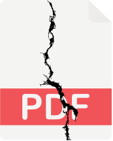

#  Splittt

Splittt is a fast and simple command-line tool written in Rust to chunk and save a given PDF file into a new folder. It is designed with performance in mind and aims to be easy to use and understand.

## Features

*   Splits a PDF file into smaller chunks based on a specified number of pages.
*   Saves each chunk as a new PDF file in a designated output directory.
*   Prioritizes performance for efficient PDF processing.

## Installation

You can install Splittt by building it from source or by downloading a pre-built binary from the [GitHub Releases page](https://github.com/your-username/splittt/releases).

### Building from Source

To build Splittt from source, you need to have Rust and Cargo installed on your system. If you don't have them installed, you can follow the instructions on the [official Rust website](https://www.rust-lang.org/tools/install).

1.  Clone the repository:

    ```bash
    git clone https://github.com/your-username/splittt.git
    cd splittt
    ```

2.  Build the project:

    ```bash
    cargo build --release
    ```

This will build the executable in the `target/release/` directory.

### Downloading a Pre-built Binary

Pre-built binaries for Linux, macOS, and Windows are available on the [GitHub Releases page](https://github.com/your-username/splittt/releases).

1.  Go to the [GitHub Releases page](https://github.com/your-username/splittt/releases).
2.  Download the appropriate binary for your operating system.
3.  Extract the downloaded archive.
4.  Add the directory containing the executable to your system's PATH, or move the executable to a directory that is already in your PATH.

## Usage

The `splittt` executable takes the following command-line arguments:

*   `-i, --input <INPUT>`: Path to the input PDF file.
*   `-o, --output <OUTPUT>`: Path to the output directory where the chunks will be saved.
*   `-s, --split <SPLIT>`: Splitting method. Specify the number of pages per chunk (e.g., `30`) or the number of equal chunks (e.g., `c5`).

### Splitting by Page Size

To split the PDF into chunks of a specified number of pages, use the `-s, --split` argument with the desired number of pages:

```bash
./target/release/splittt -i input.pdf -o output_chunks -s 5
```

This command will split `input.pdf` into chunks of 5 pages each and save them in the `output_chunks` directory.

### Splitting into N Equal Chunks

To split the PDF into a specified number of equal chunks, use the `-s, --split` argument with `c` followed by the number of chunks:

```bash
./target/release/splittt -i input.pdf -o output_chunks -s c3
```

This command will split `input.pdf` into 3 equal chunks and save them in the `output_chunks` directory.

## Contributing

Splittt is an open-source project and contributions are welcome! If you find a bug, have a feature request, or want to improve the code, feel free to open an issue or submit a pull request.

## License

This project is licensed under the [MIT License](LICENSE).
